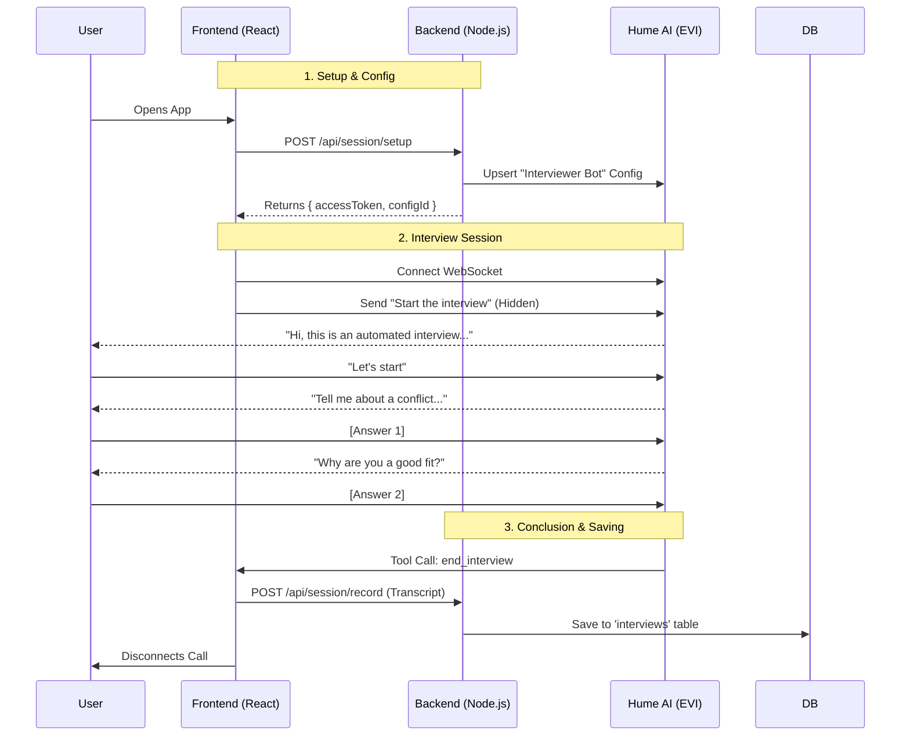

# Hume AI Interviewer Bot PoC

A production-ready Proof of Concept for an **Automated Interviewer** using Hume's Empathic Voice Interface (EVI).

## 🤖 What it Does
1.  **Auto-Starts**: The bot immediately introduces itself upon connection.
2.  **Conducts Interview**: Asks 2 preset behavioral questions.
3.  **Auto-Ends**: Recognizes completion and hangs up automatically.
4.  **Records**: Saves the full transcript and session ID to a local SQLite database.

## 🗺️ Architecture Flow



---

## ⚡ Quick Start

### 1. Backend Setup
```bash
cd backend
npm install

# Create .env file with your credentials
echo "HUME_API_KEY=your_key" >> .env
echo "HUME_SECRET_KEY=your_secret" >> .env

npm run dev
# Runs on http://localhost:3001
```

### 2. Frontend Setup
```bash
cd frontend
npm install
npm run dev
# Opens at http://localhost:5173
```

---

## 🔍 Key Features

### 1. Strict Scripting (Prompt Engineering)
The bot is configured with a "System Prompt" that strictly enforces a sequential interview flow. It is instructed to have *no reasoning capabilities* outside of asking the specific questions.

### 2. Tool Use (`end_interview`)
We define a custom tool `end_interview` in the configuration. The bot is instructed to call this tool immediately after saying goodbye. The Frontend listens for this specific tool call to trigger the "Save & Hangup" logic.

### 3. Automated Recording
When the session ends, the full conversation transcript (User + Assistant) is sent to the backend and stored in a local SQLite database (`backend/hume_configs.db`) in the `interviews` table.

---

## 📂 Important Files

| File Path | Component | Responsibility |
| :--- | :--- | :--- |
| **`backend/src/server.ts`** | **Orchestrator** | Enforces the "Interviewer" prompt config and handles `POST /record`. |
| **`frontend/src/components/VoiceChat.tsx`** | **Logic Core** | Triggers the "Start" message and listens for "End" tool calls. |
| **`backend/src/db.ts`** | **Persistence** | Stores Config IDs and Interview Transcripts. |
| **`backend/src/inspect_api.ts`** | **Utility** | Debug tool to view your current Hume configs. |
