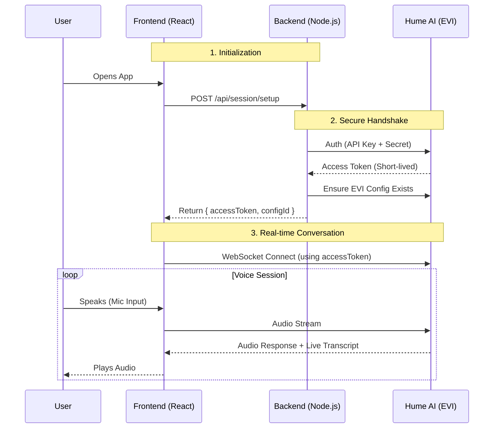

# Hume AI Speech-to-Speech PoC

A production-ready Proof of Concept for Hume's Empathic Voice Interface (EVI).

## 🗺️ Architecture Flow

This diagram shows how data flows securely between the User, your App, and Hume AI.



---

## ⚡ Quick Start

### 1. Backend Setup (Secure Proxy)
*   **Goal:** Hide API keys and manage sessions.
*   **Commands:**
    ```bash
    cd backend
    npm install
    
    # Create .env file with your credentials
    echo "HUME_API_KEY=your_key" >> .env
    echo "HUME_SECRET_KEY=your_secret" >> .env
    
    npm run dev
    # Runs on http://localhost:3001
    ```

### 2. Frontend Setup (Client)
*   **Goal:** Handle microphone, speakers, and UI.
*   **Commands:**
    ```bash
    cd frontend
    npm install
    npm run dev
    # Opens at http://localhost:5173
    ```

---

## 🔍 Key Concepts

### 1. Security First 🔒
*   **Problem:** Storing API keys in frontend code is unsafe.
*   **Solution:** Keys stay in the **Backend**. The Frontend only gets a temporary **Access Token** (valid for 60 mins).

### 2. Automatic Configuration ⚙️
*   **Problem:** Manually creating "Configs" in the Hume dashboard is tedious for setup.
*   **Solution:** The **Backend** automatically checks for a config. If none exists, it creates one (Prompt + Voice) and saves the ID to a local database (`sqlite`).

### 3. Resilience 🛡️
*   **Network:** Handles WebSocket disconnects.
*   **Auth:** Auto-refreshes tokens if they expire.
*   **Limits:** Detects and shows errors if you hit Hume's usage limits (Error 429).

---

## 📂 Important Files

| File Path | Component | Responsibility |
| :--- | :--- | :--- |
| **`backend/src/server.ts`** | **Orchestrator** | Main entry point. Handles `POST /session/setup`. |
| **`backend/src/services/humeAuth.ts`** | **Authenticator** | Talks to Hume OAuth API to get tokens. |
| **`frontend/src/App.tsx`** | **Session Manager** | Calls backend on load, handles errors. |
| **`frontend/src/components/VoiceChat.tsx`** | **UI** | Microphone button, status dots, and live transcripts. |
| **`backend/src/inspect_api.ts`** | **Utility** | Run `npx ts-node src/inspect_api.ts` to debug your Hume account configs. |