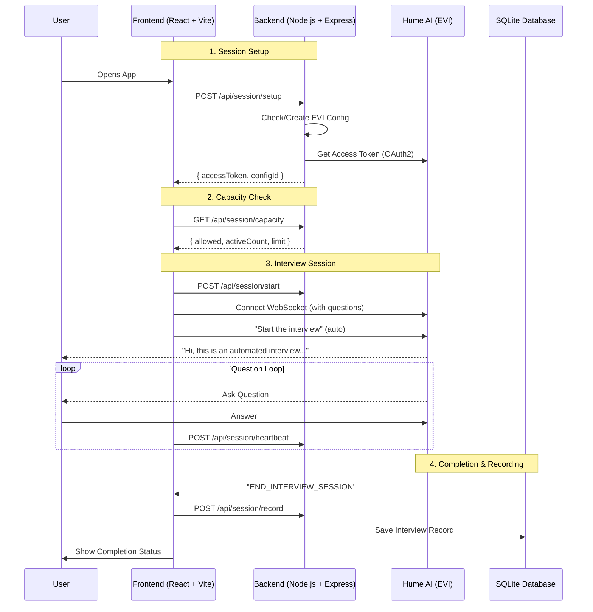

# Hume AI Interviewer Bot PoC

A production-ready Proof of Concept for an **Automated Interviewer** using Hume's Empathic Voice Interface (EVI).

## 🤖 What it Does

1. **Auto-Starts**: The bot immediately introduces itself upon connection
2. **Conducts Interview**: Asks preset behavioral questions with progress tracking
3. **Auto-Ends**: Recognizes completion and hangs up automatically
4. **Records**: Saves full transcript with status, duration, and question completion metrics
5. **Handles Errors**: Gracefully manages disconnects, tab closes, and network issues
6. **Limits Concurrency**: Prevents system overload with configurable concurrent session limits

## 🗺️ Architecture Flow



---

## ⚡ Quick Start

### Prerequisites
- Node.js 18+
- Hume AI API credentials ([Get them here](https://platform.hume.ai))

### 1. Backend Setup
```bash
cd backend
yarn install  # or npm install

# Create .env file with your credentials
cat > .env << EOF
HUME_API_KEY=your_api_key_here
HUME_SECRET_KEY=your_secret_key_here
MAX_CONCURRENT_SESSIONS=5
SESSION_STALE_TIMEOUT_MS=300000
EOF

yarn dev
# ✅ Runs on http://localhost:3001
```

### 2. Frontend Setup
```bash
cd frontend
yarn install  # or npm install
yarn dev
# ✅ Opens at http://localhost:5173
```

---

## 🔍 Key Features

### 1. Interview State Management
Comprehensive state machine with stages:
- `IDLE` → `INITIALIZING` → `CONNECTING` → `READY` → `IN_PROGRESS` → `COMPLETED`
- Error states: `ERROR`, `DISCONNECTED`

### 2. Question Progress Tracking
- Total questions vs. answered count
- Real-time progress bar
- Tracks which question is currently being asked

### 3. Loading Indicators
- Session initialization
- Capacity checking
- WebSocket connecting
- Interview saving

### 4. Error Handling
| Scenario | How It's Handled |
|----------|------------------|
| Network disconnect | Saves partial transcript, marks as INCOMPLETE |
| User ends early | Records answered questions, saves with USER_ENDED reason |
| Tab/browser close | Uses `sendBeacon` API to save before unload |
| Concurrent limit hit | Shows user-friendly message with retry option |
| Auth expired | Prompts page refresh |

### 5. Concurrent Session Limits
- Configurable max concurrent sessions (default: 5)
- Automatic stale session cleanup (default: 5 min timeout)
- Capacity check before starting interview

### 6. Interview Recording
Enhanced database records include:
- `status`: COMPLETED | INCOMPLETE | ERROR
- `disconnect_reason`: completed | user_ended | tab_closed | error
- `questions_answered` / `total_questions`
- `duration_ms`
- `error_reason` (if applicable)

---

## 📡 API Endpoints

### Session Management
| Endpoint | Method | Description |
|----------|--------|-------------|
| `/api/session/setup` | POST | Initialize session, get access token & config |
| `/api/session/capacity` | GET | Check if new sessions can be started |
| `/api/session/start` | POST | Reserve a session slot |
| `/api/session/heartbeat` | POST | Keep session alive, update progress |
| `/api/session/end` | POST | Release session slot |
| `/api/session/record` | POST | Save interview with full metadata |
| `/api/session/active` | GET | List active sessions (debug) |

### Utility
| Endpoint | Method | Description |
|----------|--------|-------------|
| `/health` | GET | Health check |
| `/api/reset` | POST | Clear all database tables |

---

## 📂 Project Structure

```
├── backend/
│   ├── src/
│   │   ├── server.ts              # Express app, all endpoints
│   │   ├── db.ts                  # SQLite operations
│   │   ├── routes/
│   │   │   └── hume.ts            # Hume API management routes
│   │   ├── services/
│   │   │   ├── humeAuth.ts        # OAuth2 token exchange
│   │   │   ├── humeConfig.ts      # EVI config management
│   │   │   └── sessionManager.ts  # Concurrent session tracking
│   │   └── types/
│   │       └── hume.ts            # TypeScript interfaces
│   └── package.json
│
├── frontend/
│   ├── src/
│   │   ├── App.tsx                # Main app with state & error UI
│   │   ├── components/
│   │   │   ├── VoiceChat.tsx      # Core interview logic
│   │   │   └── ArchitectureView.tsx
│   │   ├── hooks/
│   │   │   ├── useInterviewState.ts  # State machine reducer
│   │   │   └── useBeforeUnload.ts    # Tab close handler
│   │   ├── api/
│   │   │   └── session.ts         # Backend API client
│   │   ├── utils/
│   │   │   └── errorMapper.ts     # Error categorization
│   │   └── types/
│   │       ├── index.ts           # Core types
│   │       └── interview.ts       # Interview state types
│   └── package.json
│
└── docs/                          # Documentation
```

---

## 🛠️ Configuration

### Backend Environment Variables

| Variable | Default | Description |
|----------|---------|-------------|
| `HUME_API_KEY` | required | Hume AI API key |
| `HUME_SECRET_KEY` | required | Hume AI secret key |
| `PORT` | 3001 | Server port |
| `MAX_CONCURRENT_SESSIONS` | 5 | Max simultaneous interviews |
| `SESSION_STALE_TIMEOUT_MS` | 300000 | Session timeout (5 min) |

### Interview Questions
Questions are defined in `frontend/src/components/VoiceChat.tsx`:
```typescript
const INTERVIEW_QUESTIONS = [
  "Tell me about your most challenging project.",
  "How do you stay updated with the latest technology trends?",
  "Describe a time you had to learn something very quickly.",
];
```

---

## 🔒 Security

- **API keys never exposed to frontend** - OAuth2 token exchange happens server-side
- **Access tokens are short-lived** - Exchanged fresh for each session
- **Session limits prevent abuse** - Concurrent session caps protect resources
- **Graceful error handling** - No sensitive data leaked in error messages

---

## 📊 Database Schema

```sql
-- Interview Records
CREATE TABLE interviews (
  id INTEGER PRIMARY KEY AUTOINCREMENT,
  chat_group_id TEXT,
  transcript TEXT,
  status TEXT DEFAULT 'COMPLETED',        -- COMPLETED | INCOMPLETE | ERROR
  disconnect_reason TEXT,                  -- completed | user_ended | tab_closed | error
  questions_answered INTEGER DEFAULT 0,
  total_questions INTEGER DEFAULT 0,
  duration_ms INTEGER DEFAULT 0,
  error_reason TEXT,
  created_at DATETIME DEFAULT CURRENT_TIMESTAMP
);

-- Config Storage
CREATE TABLE configs (
  key TEXT PRIMARY KEY,
  value TEXT
);
```

---

## 📚 Documentation

See the `/docs` folder for detailed implementation guides:
- [Project Documentation](./docs/README.md) - Complete project documentation
- [Implementation Guide](./docs/IMPLEMENTATION_GUIDE.md) - Step-by-step setup

---

## 🧪 Testing

```bash
# TypeScript checks
cd backend && npx tsc --noEmit
cd frontend && npx tsc --noEmit

# Health check
curl http://localhost:3001/health

# Check capacity
curl http://localhost:3001/api/session/capacity

# View active sessions
curl http://localhost:3001/api/session/active
```

---

## 📝 License

MIT

---

**Built with [Hume AI](https://hume.ai) Empathic Voice Interface (EVI)**
